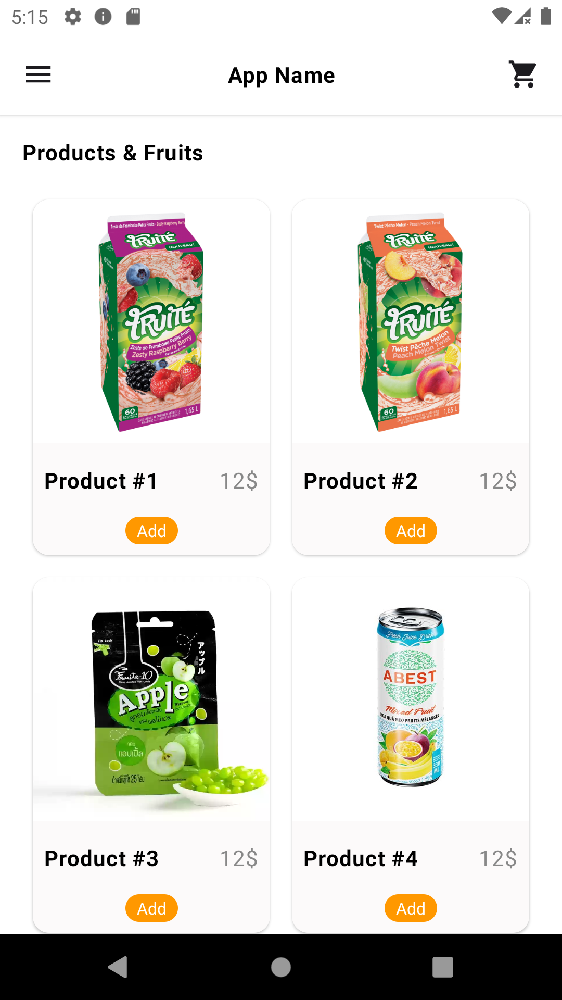
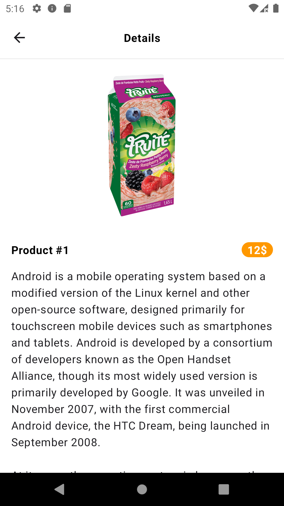
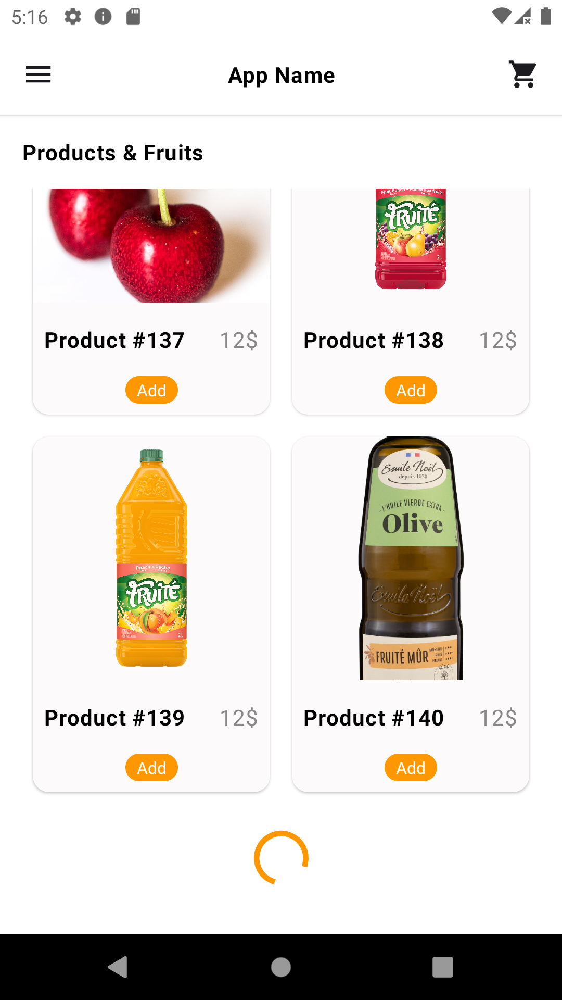

# Product List Demo

The app have two screen:

- HomeScreen - All products
- DetailsScreen - details is selected product

# HomeScreen

20 items will be loaded when you enter the app, 20 items will be loaded if you scroll again

Home screen

Details screen

Home screen loading next page

# DetailsScreen

When clicked product item, opening details screen.

# Using Tech.

|                    |Tech. Name						
|--------------------|-------------------------------
| UI				 | Jetpach Compose               
| DI				 | Dagger Hilt                  
| Arch. Pattern      | MVI
| Project arch.		 | Single Activity
| Arch. component    | Clean Arch.
| Async task		 | Kotlin coroutines
| Image loader		 | Coil
| Pagination		 | Paging 3